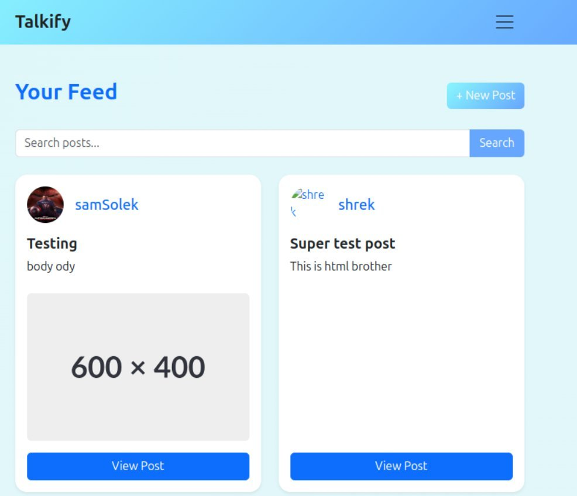

# Talkify — Social Media Web App

Talkify is a social media web application built with Bootstrap 5 and the Noroff Social API for the CSS Frameworks course. Users can register, log in, manage their profile, follow others, and create, read, update and delete posts.



## Description

Talkify was built as the CSS Frameworks course assignment. The goal was to build a working social platform on top of a CSS framework, using Bootstrap's grid and components for a consistent, responsive interface while wiring up real functionality against an API.

The application includes:

* User authentication (register, log in, log out)
* Profile pages with follow and unfollow
* Create, read, update and delete posts
* View posts with comments
* Search posts by title, body or author
* Responsive, mobile-friendly UI

## Built With

* [Bootstrap 5](https://getbootstrap.com/)
* HTML5
* JavaScript (ES Modules)
* [Noroff Social API](https://docs.noroff.dev/docs/v2)

## Getting Started

### Installing

1. Clone the repo:
```bash
git clone https://github.com/Shamia702/social-media-app.git
```

2. Open the project folder:
```bash
cd social-media-app
```

### Running

This is a plain HTML, CSS and JavaScript project, so there are no dependencies to install.

* Open `index.html` directly in your browser, **or**
* In VS Code, right-click `index.html` and choose **Open with Live Server**.

## Live Site

Deployed on Netlify: [Visit Live Website](https://talkify-webapp.netlify.app)

## Contact

* [My LinkedIn page](https://www.linkedin.com/in/shamia-shamia-6892a81a2/)
* [My GitHub page](https://github.com/Shamia702)

## Acknowledgments

* Noroff front-end development course materials
* [Noroff Social API](https://docs.noroff.dev/docs/v2)